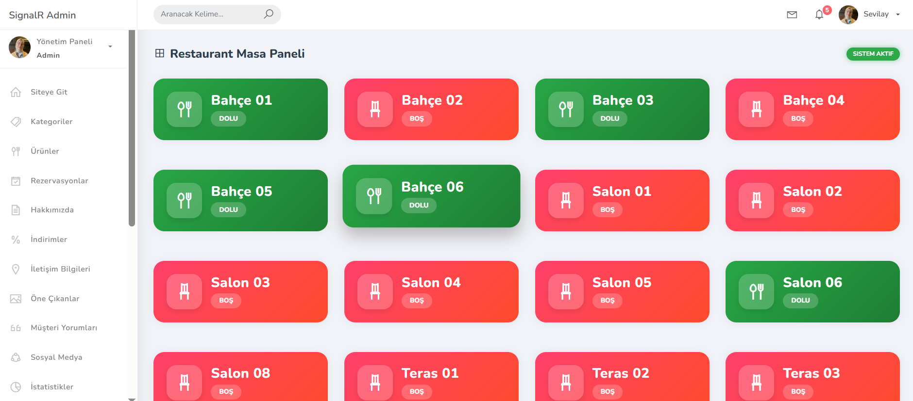

# 🍽️ SignalRDine – Restaurant Management System

Bu proje, **ASP.NET Core Web API** ve **ASP.NET Core MVC (WebUI)** kullanılarak geliştirilmiş,  
**çok katmanlı mimariye (N-Tier / Layered Architecture)** sahip bir restoran yönetim sistemidir.

Proje; **gerçek bir restoran senaryosu** baz alınarak masa yönetimi, sipariş akışı, anlık bildirimler, QR kod işlemleri ve finansal süreçleri kapsayacak şekilde; **performans, sürdürülebilirlik ve ölçeklenebilirlik** prensipleri gözetilerek geliştirilmiştir.

> 📌 Proje, birebir dersler takip edilerek uygulanmış olup; sektör standartlarına uygun mimari ve kodlama pratiklerini öğrenme ve pekiştirme amacı taşımaktadır.

---

## 🧩 Mimari Yapı

- **Entity Layer** → Veritabanı varlıkları  
- **Data Access Layer** → EF Core ile veri erişimi  
- **Business Layer** → İş kuralları ve servisler  
- **Web API** → RESTful servisler  
- **WebUI (MVC)** → Kullanıcı arayüzü  
- **DTO Layer** → Güvenli ve kontrollü veri transferi  
- **Test Layer** → xUnit ile birim testleri (Unit Tests)

---

## 🚀 Öne Çıkan Özellikler

### 🛡️ Kalite Güvencesi & Güvenlik
- **xUnit Unit Testing:** Ürün fiyat mantığı, AutoMapper eşleşmeleri ve Entity ilişkileri (Category–Product–Order) için kapsamlı test senaryoları kurgulandı.
- **Global Exception Handling:** Özel yazılan **Middleware** ile uygulama genelindeki tüm hatalar merkezi olarak yakalanır.
- **Serilog Logging:** Uygulama hareketleri ve hatalar dosya tabanlı olarak loglanır.
- **Identity & Authorization:** Rol bazlı yetkilendirme ve global authorize filtreleri uygulandı.
- **Service Extensions:** DI ve konfigürasyonlar extension metodları ile yönetildi.

### 🌍 Dünya Mutfağı Entegrasyonu
- **RapidAPI (Tasty) Entegrasyonu:** Tarif videoları, görseller ve hazırlık süreleri dinamik olarak listelendi.

### 🪑 Masa Seçimi & Akıllı Yönlendirme
- Masaların doluluk durumuna göre **Boş / Dolu** (Yeşil / Kırmızı) görselleştirme.
- **Boş Masalar:** Ürün seçim menüsüne yönlendirme  
- **Dolu Masalar:** Sepet ve ödeme sürecine yönlendirme

### 🧾 Gelişmiş Sepet & Hesaplama Sistemi
- **AJAX destekli sepet yönetimi**
- %10 KDV ve genel toplam hesaplamaları
- Performans odaklı iş kuralları

### 📱 QR Kod Yönetimi
- **QRCoder** ile QR kod üretimi
- **ZXing.Net** ile QR kod çözümleme
- Temassız sipariş altyapısı

### ⚡ SignalR – Gerçek Zamanlı İletişim
- Masa ve sipariş durumlarının anlık takibi
- Dashboard üzerinde canlı veri güncellemeleri

### 📖 API Dokümantasyonu
- **Swagger & XML Docs** ile detaylı API dokümantasyonu
- **Postman** koleksiyonları ile test senaryoları

---

## 📸 Proje Ekran Görüntüleri

  
<b>Click to view Screenshots / Ekran Görüntülerini Gör</b>

   

  #### 🏠 Ana Sayfa & Menü
  

  #### 🛒 Sipariş Sepeti
  

  #### 🪑 Masa Durumları (Real-Time)
  

  #### 📱 QR Code Entegrasyonu
  

  #### ⚙️ API Dokümantasyonu (Swagger)
  

  #### 🧪 Unit Testler
  

---

## 🛠 Kullanılan Teknolojiler

- **Backend:** .NET 8, Web API, EF Core, Identity, SignalR, AutoMapper  
- **Testing:** xUnit, Moq, FluentAssertions  
- **Logging:** Serilog  
- **Frontend:** ASP.NET Core MVC, AJAX, Bootstrap, JavaScript  
- **Araçlar:** QRCoder, ZXing.Net, MailKit, MimeKit  
- **Veritabanı:** MS SQL Server  

---

## 🔐 Güvenlik & Yapılandırma

- Global Authorization Policy
- **HttpClient Factory** ile güvenli HTTP yönetimi
- Exception Middleware & Logging Pipeline

---

## 📌 Amaç

Bu proje ile:
- Katmanlı mimari mantığını kavramak  
- Gerçek zamanlı (real-time) uygulamalar geliştirmek  
- Kurumsal projelere uygun backend & frontend yapıları deneyimlemek  
amaçlanmıştır.
